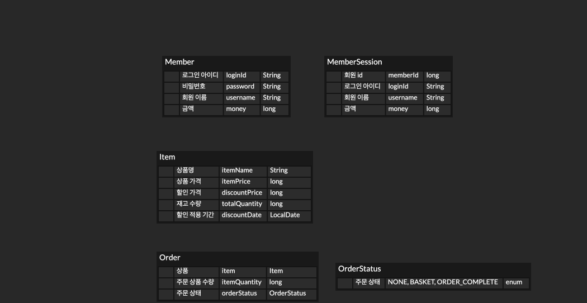
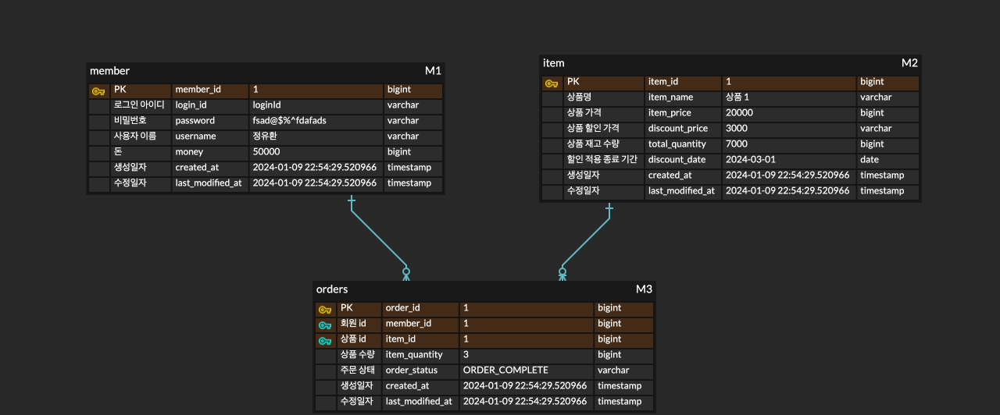

## 프로젝트 목표

비즈니스 로직의 구현을 담당하는 도메인과 DB와 관련된 로직을 담당하는 엔티티를 분리해보자.         

## 프로젝트를 하는 이유

그동안 도메인과 엔티티를 분리하는 것에 대한 장점이 크게 납득이 되지 않았습니다.     
하지만 개인 프로젝트에서 여러 가지 테스트를 하며 고민해보고 인턴을 하며 회사 코드에 적용을 해보았는데     
이것이 꽤 유의미한 작업이 될 것이라고 생각했습니다.     

요구사항에 대한 구현을 더 잘하기 위해 도메인과 DB 엔티티를 분리하는 작업을 해보겠습니다.

## 쇼핑몰 서비스의 요구 사항 정리

### 회원

- 회원가입 - 제한 조건 없음
- 로그인 - 쿠키, 세션 방식

### 상품

- 상품을 상품 리스트에 추가한다.
- 상품을 장바구니에 넣는다.
- 각 상품은 특정 기간에 할인을 적용할 수 있다.

### 주문 

- 장바구니에 있는 상품을 주문한다.
- 주문시 각 상품의 할인 적용 여부에 따라 적용 후 가격을 계산한다.
- 계산한 가격으로 결제를 완료한다.
  - [예외처리] 회원의 돈이 주문 가격보다 적으면 예외가 발생한다.

### 상품 재고 관리

- 주문 상품의 수가 재고보다 많은지/적은지 확인한다.
  - [예외처리] 재고보다 적으면 예외가 발생한다.
  - [주의할 점] 처리시 동시성 문제 주의
- 주문한 상품의 수만큼 재고에서 뺀다.

## 도메인 모델

## DB 엔티티 모델

## 분리했을 때의 장단점

직접 이렇게 구현을 해보고 느낀점에 대해 작성 해보겠습니다.     
구현을 해보면서 가장 좋았던 점은 JPA와 같은 ORM에 의존하지 않아도 된다는 것이었습니다.    
JPA와 같은 ORM을 사용하는 이유 중 하나는 객체와 RDB 사이의 패러다임 불일치 문제를 해결해준다는 것입니다.    

하지만 트레이드 오프는 항상 있습니다. 패러다임 불일치 문제를 해결하는 대신 객체 매핑을 했을 때의 단점은   
분명합니다. 특히 양방향 매핑을 했을 때는 하나의 객체로 묶이는 것과 같이 유연성이 매우 떨어집니다.   
객체와 RDB 사이의 불일치 문제를 해결하기 보다는 각각을 따로 두면 해결될 문제라고 생각합니다.  

1. RDB에 의존하는 DB 엔티티를 두고 연관 관계가 있다면 객체 매핑이 아닌 id 참조를 한다.   
2. RDB에 의존하지 않는 도메인에서의 관계는 객체로 참조한다.   

이렇게 분리를 했을 때의 또 다른 장점은 테스트를 작성하기가 쉬워진다는 점입니다.     
도메인에 로직이 많아질 수록 Spring과 JPA에 의존하지 않는 순수한 자바 코드로 테스트 할 수 있는 부분이 많아집니다.    

단점이라고 한다면 개발하는 코드가 더 많아져서 개발 시간이 더 길어진다는 것이 있을 수 있지만   
장기적으로 보았을 때 유지 보수가 더 쉬운 코드가 되어 오히려 시간이 단축될 수 있다고 생각합니다.    
하지만 이 부분은 직접 느끼고 작성한 부분은 아니기 때문에 다른 팀원들과 프로젝트를 해보고 다시 정리 해보겠습니다.     

      
더 자세한 설명은 블로그에 작성하였습니다.  

[도메인과 DB 엔티티를 분리하는 이유](https://320hwany.tistory.com/110)     
